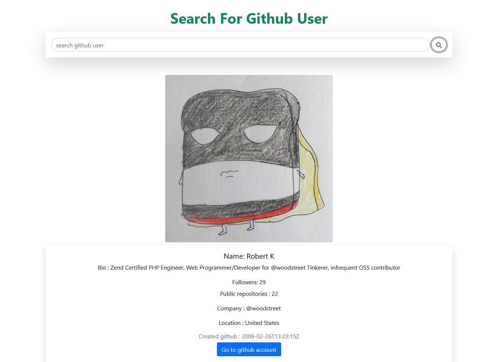

# Github Finder

### live site : https://github-finder101.netlify.app/

## API Link
URL Format: https://api.github.com/users/{searchText} `searchtext` based on search result

Example: https://api.github.com/users/a

## Output
### Desktop view

### Mobile view

